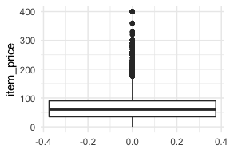
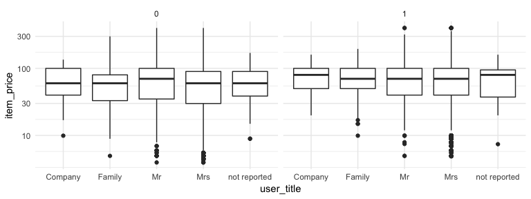
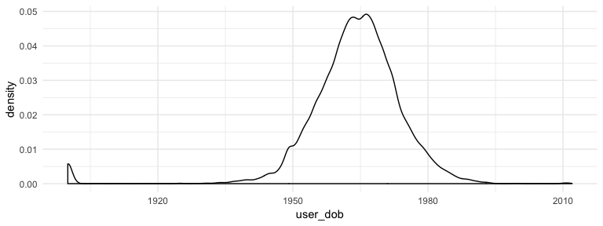
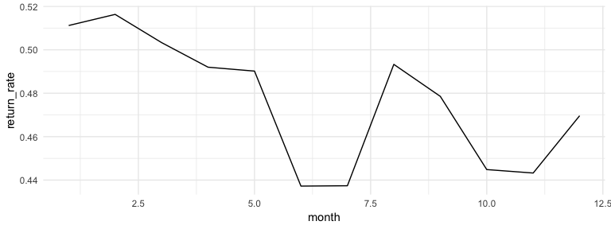

Introduction
============

E-commerce has become one of the most successful businesses, which strived in the era of Internet. Many companies turned from brick and mortar to online retailing. It is growing rapidly and one of the largest corporations in the world (Amazon, JD, Alibaba, Rakuten, eBay) are the example how well this business model can work. It is expected to reach $4 trillion by 2020.

Despite this fact many players on this field fail to gain profit (Rigby, D. 2014). The main reason behind it is the unexpected behavior of customers and the returns of the purchased product, which most of the times cost companies dearly, as to deal with competition they need to offer returns for free. Other than shipping cost, there are some significant direct costs associated with the process, like re-stocking and re-furbishing. Indirect costs consist of potential loss of customers, lowering their satisfaction and high demand for call center. Some of the recently conducted studies showed that one-third of all e-commerce orders are returned every year. The rate goes to more than 50% in retailers specialized in fashion (Asdecker, 2015). As the internal research of online retailers showed, decreasing the return rates by 10% could increase the profit double that time.

One way to deal with the returns is simply denying this option to customers, but most of the companies are required by law to allow people to return items within certain period of time after the purchase. Also, this would give competitors huge edge and might mean more loss to the business. Studies showed that more generous return policy is associated with better customer satisfaction, which results in increased purchase rates and overall longer lifetime cycle of the customer. So, most of the times it is better to react preemptively and prevent customer from buying the item, which is high likely to be returned, at all. This approach consists of two sub problems, which needs to be solved, so the company can maximize its profit. First the good machine learning model needs to be created, which can predict whether customer is likely to return specific item or not. Nudging prospect not to buy a certain product, in itself means giving up on potential income and if not predicted correctly this might give bigger loss to company than not having any model in place at all. Second part, which is easier, is to choose best method of intervention. There are several of them starting with soft ones, for example not giving customer all the options to pay for the item (like using PayPal), increase delivery time (like removing Prime delivery option) or at extremes even rejecting the transaction or giving out of stock warning.

The purpose of this document is to analyze the provided data regarding historical purchase decisions of online shop users, use machine learning techniques on it and based on this predict if customer is likely to return the item in the future or not. The first part of the document represents general overview of the data and brings some insights using exploratory data analysis. In second part the model is discussed and the performance is evaluated. Lastly the conclusions are provided.

Exploratory data analysis
=========================

As the first step exploratory data analysis is done in order to discover patterns in data and get overall understanding of it. First let us take a look at the data itself.

<table class="table" style="font-size: 5.5px; margin-left: auto; margin-right: auto;">
<thead>
<tr>
<th style="text-align:left;">
order
</th>
<th style="text-align:left;">
delivery
</th>
<th style="text-align:left;">
item\_id
</th>
<th style="text-align:left;">
size
</th>
<th style="text-align:left;">
color
</th>
<th style="text-align:left;">
brand
</th>
<th style="text-align:right;">
price
</th>
<th style="text-align:left;">
user
</th>
<th style="text-align:left;">
title
</th>
<th style="text-align:left;">
dob
</th>
<th style="text-align:left;">
state
</th>
<th style="text-align:left;">
registration
</th>
<th style="text-align:right;">
return
</th>
</tr>
</thead>
<tbody>
<tr>
<td style="text-align:left;">
2016-05-13
</td>
<td style="text-align:left;">
2016-05-16
</td>
<td style="text-align:left;">
1040
</td>
<td style="text-align:left;">
38
</td>
<td style="text-align:left;">
red
</td>
<td style="text-align:left;">
138
</td>
<td style="text-align:right;">
69.9
</td>
<td style="text-align:left;">
19065
</td>
<td style="text-align:left;">
Mrs
</td>
<td style="text-align:left;">
NA
</td>
<td style="text-align:left;">
Lower Saxony
</td>
<td style="text-align:left;">
2016-05-14
</td>
<td style="text-align:right;">
1
</td>
</tr>
<tr>
<td style="text-align:left;">
2016-09-26
</td>
<td style="text-align:left;">
NA
</td>
<td style="text-align:left;">
4490
</td>
<td style="text-align:left;">
m
</td>
<td style="text-align:left;">
grey
</td>
<td style="text-align:left;">
133
</td>
<td style="text-align:right;">
59.9
</td>
<td style="text-align:left;">
32349
</td>
<td style="text-align:left;">
Mrs
</td>
<td style="text-align:left;">
1967-02-21
</td>
<td style="text-align:left;">
North Rhine-Westphalia
</td>
<td style="text-align:left;">
2015-02-17
</td>
<td style="text-align:right;">
0
</td>
</tr>
<tr>
<td style="text-align:left;">
2017-02-28
</td>
<td style="text-align:left;">
2017-05-09
</td>
<td style="text-align:left;">
4792
</td>
<td style="text-align:left;">
m
</td>
<td style="text-align:left;">
ecru
</td>
<td style="text-align:left;">
128
</td>
<td style="text-align:right;">
99.9
</td>
<td style="text-align:left;">
74743
</td>
<td style="text-align:left;">
Mrs
</td>
<td style="text-align:left;">
NA
</td>
<td style="text-align:left;">
North Rhine-Westphalia
</td>
<td style="text-align:left;">
2017-02-14
</td>
<td style="text-align:right;">
0
</td>
</tr>
<tr>
<td style="text-align:left;">
2017-01-23
</td>
<td style="text-align:left;">
2017-01-24
</td>
<td style="text-align:left;">
4686
</td>
<td style="text-align:left;">
L
</td>
<td style="text-align:left;">
terracotta
</td>
<td style="text-align:left;">
105
</td>
<td style="text-align:right;">
59.9
</td>
<td style="text-align:left;">
32935
</td>
<td style="text-align:left;">
Mrs
</td>
<td style="text-align:left;">
1961-01-08
</td>
<td style="text-align:left;">
North Rhine-Westphalia
</td>
<td style="text-align:left;">
2015-02-17
</td>
<td style="text-align:right;">
0
</td>
</tr>
<tr>
<td style="text-align:left;">
2016-05-13
</td>
<td style="text-align:left;">
2016-05-16
</td>
<td style="text-align:left;">
648
</td>
<td style="text-align:left;">
39
</td>
<td style="text-align:left;">
petrol
</td>
<td style="text-align:left;">
170
</td>
<td style="text-align:right;">
139.9
</td>
<td style="text-align:left;">
2842
</td>
<td style="text-align:left;">
Mrs
</td>
<td style="text-align:left;">
1966-05-01
</td>
<td style="text-align:left;">
Schleswig-Holstein
</td>
<td style="text-align:left;">
2015-04-06
</td>
<td style="text-align:right;">
1
</td>
</tr>
<tr>
<td style="text-align:left;">
2016-06-27
</td>
<td style="text-align:left;">
2016-06-29
</td>
<td style="text-align:left;">
826
</td>
<td style="text-align:left;">
46
</td>
<td style="text-align:left;">
purple
</td>
<td style="text-align:left;">
111
</td>
<td style="text-align:right;">
44.9
</td>
<td style="text-align:left;">
10005
</td>
<td style="text-align:left;">
Mrs
</td>
<td style="text-align:left;">
1958-03-05
</td>
<td style="text-align:left;">
North Rhine-Westphalia
</td>
<td style="text-align:left;">
2015-02-17
</td>
<td style="text-align:right;">
1
</td>
</tr>
</tbody>
</table>
Taking look at it we can separate important and non-important fields that can be later used in the model. For example, order\_item\_id can be removed from the list as it only serves indexing purpose and is not very useful. On the other hand, it can be assumed that price is one of the most important feature for item. First we can see how price is distributed using boxplot and quantiles.



    ##     0%    25%    50%    75%   100% 
    ##   0.00  34.90  59.90  89.90 399.95

Most of the items are priced under hundred, with some exceptions.

As data shows there are different groups of people. It would be intresting to check if there is difference between their purchase behaviour and return decision.



After checking price related statistics we can move to analyzing the people who buy these items



As it can be observed the age data is quite normally distributed with some exceptions. This can be people who intentionally did not wanted to share this information. Later we can modify this field and exclude such values, or replace them with some logical ones.

Next it will be interesting to see if there is some seasonality in the returns.



As it turns out there is a small difference between different month, but the difference is not significant enough. Not to lose any information this factor still can be considered in the feature selection process.

One of the important field for analyzing can be delivery. We could check what is average time for delivering item. If there is and correlation between long delivery times and returns. And if there is any anomaly here. After checking all the data there is only one suspicions date for which delivery date is less than order date

    ## # A tibble: 1 x 2
    ##   delivery_date     n
    ##   <date>        <int>
    ## 1 1994-12-31      959

And for this date there is no return at all.

After briefly taking look at the known data, it would be interesting to compare it with the unknown data and check if there is some differences, which can influence the process of choosing specific fields for further analysis.

As it turned out there is significant difference between brands and items and the ids are not matching each others. Which makes this two fields useless if used directly.

We can also use t-test to check if there is any difference between price distribution of both set. Considering high p-value. There is no significant difference between two testsets.

    ## 
    ##  Welch Two Sample t-test
    ## 
    ## data:  knownData$item_price and unknownData$item_price
    ## t = -0.77797, df = 98028, p-value = 0.4366
    ## alternative hypothesis: true difference in means is not equal to 0
    ## 95 percent confidence interval:
    ##  -0.6846958  0.2955948
    ## sample estimates:
    ## mean of x mean of y 
    ##  70.27914  70.47369

Data preparation & Feature selection
====================================

After gathering all the insights we can move cleaning and preparing the data. For this a separate function is created which handles both known and unknown Data.

The insights from EDA step is considered for feature creation and replacing current values.

First the time series data is analysed and dealt with. \#\#\# Delivery Dates As the delivery dates contain missing values, as well as some odd date, mean delivery date is calculated, so it can replace these values. On the other hand new field is created which is directly connected to the missing values, as being missing is important information and model could benefit from it.

### User Date of Birth

As delivery dates, user date of birth also contains some odd numbers. Same approach as previously is used for dealing this value. First it is assumed that users can only be between "1945-01-01" and “2001-01-01". All other values that are not in this range are replaced by median date of birth, as mean seemed to be highly influenced b extreme values.

### New fields regarding dates

After cleaning these two columns, new variables are generated, which later can turn out to be usefull. 1) User Age 2) User Birth Month 3) Number of Days fo reach user registration 4) Order Month and date to take seasonality into consideration

### Colors

It can be assumed that colors are important factor for customers, while making purchase decision and getting wrong color can be one of the reasons for returning items. As it turns out there is some very specific colors for each data set and they are not matching, meaning they can not be later used for creating dummy variables. To solve this issue, first some typos are corrected. Second colors which are less than 0.5% of all colors are considered insignificant and are combined under "other" label.

### Sizes

As Colors sizes can play crucial role into decision making. One of the biggest problem of online shops remains exact sizing and users tend to make mistakes regarding sizes, as they are not universal for each brand and item.

To deal with sizes they are divided into several groups based on their value will it be character like XL, L, or number like 43, 44 and so on. Based on this value, first we try to calculate origin of the brand, will it be US, EU or unknown. After this is done all models are converted from numeric to character, as it is easier for model to generate dummy data for smaller sample.

### Frequenct based features.

As seen in EDA, we can not use directly the values of brand and item, even though they might be best indicators for return. But we can use their frequency as they are sold to calculate whether brand is popular or not and how often it is sold. Same can be applied to items and user activity (meaning what is the total number of purchases for person). One other field which can indicate how active and loyal customer is can be the number of purchases from him/her.

All these features are generated by CleanAndFeatures.R function.

Model tuning, selection and evaluation
======================================

The models used for predicting the data are XGboost and Random Forest, due to their robustness. Also h2o library is used for Neural Networks and deep learning. These models work best with AUC and it is hard to give cost sensitive functionality to them as there is no build in function for this. To take cost sensitivity into consideration glm is used.

Before giving cleaned data to models it is first mandatory to convert them to the numeric fields, as some models do not accept factor variables. There are two possibilities to solve this issue. First WOE (Weight of evidence) and second dummy variables. As evaluated in the model both approaches gave almost same result, with small difference in favor of dummy variables. On the XGB Model using dummy variable gave 1% improvement of AUC over WOE. On the other hand, WOE tend to be much faster. But as result is important factor here, Dummy variables were chosen. Once data is dummified, it is partitioned.

``` r
# xgb.parms <- makeParamSet(
#   makeNumericParam("eta", lower = 0.001, upper = 0.9),
#   makeIntegerParam("nrounds", lower=10, upper=1000), 
#   makeIntegerParam("max_depth", lower=2, upper=100), 
#   makeDiscreteParam("gamma", values = 1),
#   makeDiscreteParam("colsample_bytree", values = 1), 
#   makeDiscreteParam("min_child_weight", values = 1),
#   makeDiscreteParam("subsample", values = 0.5)
# )
# 
# tuneControl <- makeTuneControlRandom(maxit=500, tune.threshold = FALSE)
# 
# rdesc <- makeResampleDesc(method = "CV", iters = 500, stratify = TRUE)
# 
```

After partitioning data is given to two models, XGboost and random forest. To find best parameters models are tuned and then run using parallel computing. After tuning is finished models are compared using AUC. As shown in results XGBoost gives superior performance over random forest. (check XGB.R)

xgb.auc rf.auc 0.7111228 0.6807509

To make model complete and predict best AUC possible deep learning techniques are used. The library h2o is used for this. (check nn.r). After getting final prediction from this model as well, simple averaging method is used to get final prediction of AUC for returning items. The approach below predicted more than 69 percent of cases correctly.

Ensemble: (check ensemble.R) To get even better predictions h2o ensemble method is used. As the ensemble could contain several models, there were no significant improvement over the previous approach. Due to this reason for final submission simple averaging of prediction methods were used.

After using AUC for predictions, which is built feature for most of the models, the next step is to consider cost sensitivity. The cost functions for false negative and false positive features were provided in the assignment. One of the most generic method used for prediction considering cost sensitivity is glm, which directly supports this functionality. For GLM to work, first data is Partitioned and preprocessed.

Using GLM directly without costs provides following results:

``` r
#          Reference
# Prediction    0    1
#          0 7256 3799
#          1 5700 8244
```

But when costs are added results are changed to:

``` r
#          Reference
# Prediction    0    1
#          0 9740 7182
#          1 3216 4861
```

The result of glm can be improved by finding the most optimal cutoff point. Which for our case tends to be 0.3. Despite this finding the accuracy on model remains still same.

Final Method
============

As the final method we could use Bayes optimal, cost‐minimal threshold assuming zero costs for correct classification

Using this approach allows us to use previous predictions, which already had high AUC and not rely On GLM- logit method.

Conclusion
==========

There were several challenges in the data. On the preprocessing phase, one of the main problem which occurred were inconsistency between known and unknown data and especially relationship between items and brands, which taking real situation into consideration could have been great help, as people most of the time have direct affection to the specific brand and specific item of it. After data was preprocessed and variables selected the new challenges occurred. Currently most of the function does not support cost sensitive learning. Because of this basic model from glm was selected to create first predictions. As seen glm can be very biased towards costs and can provide biased results. Despite this fact current models prove to provide correct model with accuracy of 70% which itself is great result, considering that decisions needed to be made specifically on features of items (such as color, price, size) and not based on items itself.

Bibliography:
=============

1.  Rigby, D. 2014. “Online Shopping Isn’t as Profitable as You Think,” <https://hbr.org/2014/08/online-shopping-isnt-as-profitable-as-you-think/>
2.  Asdecker, B. 2015. “Statistiken Retouren Deutschland - Definition,” <http://www.retourenforschung.de/>
3.  Yada Zhu1, Jianbo Li2, Jingrui He3, Brian L. Quanz1, Ajay A. Deshpande1 - A Local Algorithm for Product Return Prediction in E-Commerce
